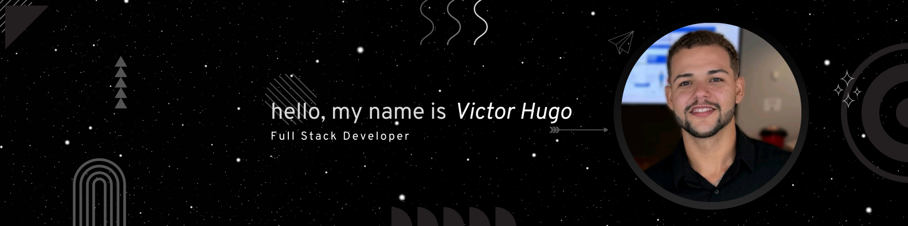

<p align="center">
  
</p>

<h1 align="center">👋 Olá, eu sou o Victor Hugo</h1>
<p align="center"><i>Desenvolvedor Web apaixonado por criar soluções modernas e elegantes.</i></p>

---

### 🧠 Sobre mim

```ts
const dev = {
  nome: "Victor Hugo",
  role: "Desenvolvedor Web",
  experiencia: "+3 anos",
  stack: ["JavaScript", "TypeScript", "React", "Next.js", "Node.js", "TailwindCSS"],
  bancoDeDados: ["MySQL", "PostgreSQL"],
  estudando: "Análise e Desenvolvimento de Sistemas",
  linkedin: "https://linkedin.com/in/vitoinacio",
  paixão: "Criar interfaces bonitas e funcionais"
}
```

---

### 🚀 Tecnologias

<div align="center">
  
</div>

---

### 📫 Vamos nos conectar

<p align="center">
  <a href="https://linkedin.com/in/vitoinacio">
    
  </a>
</p>

---

### 🎯 Dev Life

```css
.dev-life::after {
  content: "⌛ Desenvolvendo com propósito...";
  animation: blink 1s infinite;
}

@keyframes blink {
  0% { opacity: 1; }
  50% { opacity: 0.2; }
  100% { opacity: 1; }
}
```

---

<p align="center"><i>“Transformando ideias em código, e código em experiência.”</i></p>
